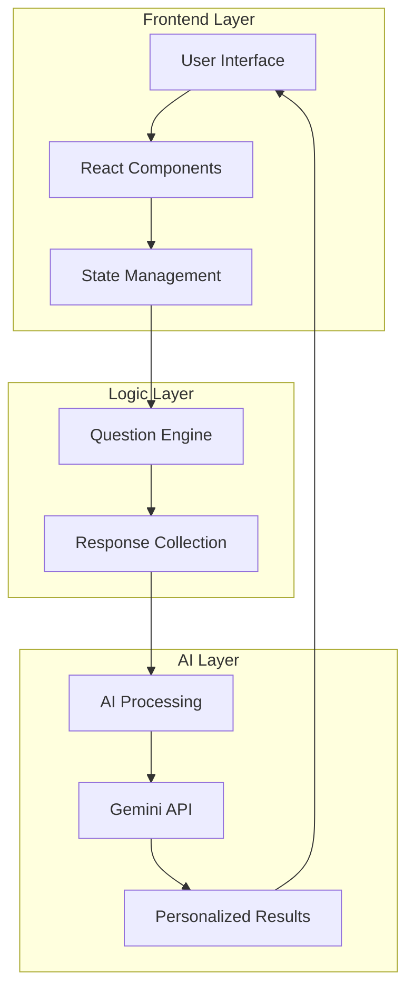
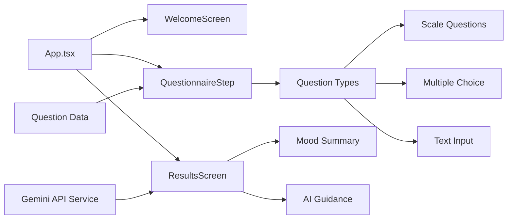
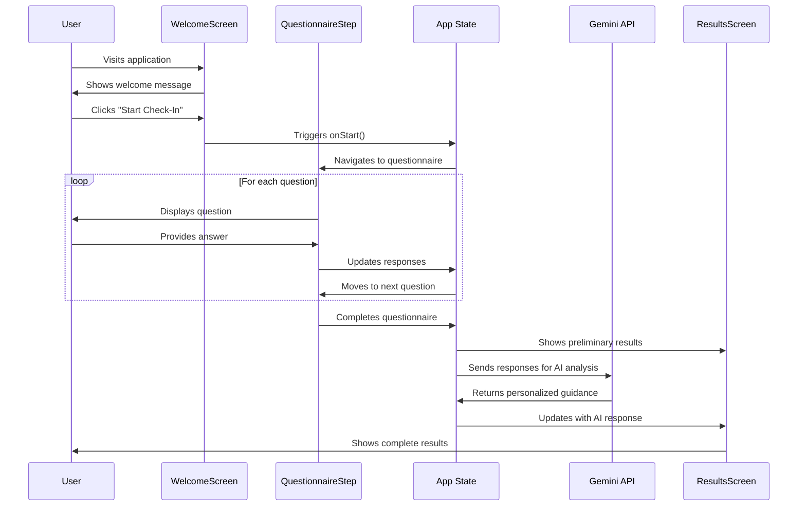

# 🧠 Mental Health Check-in Bot

A modern, empathetic web application that helps users assess their mental health through an interactive questionnaire and receive personalized guidance powered by AI.


## 🌟 Features

- ✅ **Intuitive Interface**: Modern design with smooth animations and micro-interactions
- 🎯 **Adaptive Questionnaire**: Various question types (scales, multiple choice, text input)
- 🤖 **AI-Powered Insights**: Personalized advice generated by Google's Gemini AI
- 📊 **Visual Results**: Clear mental health summary with actionable recommendations
- 🔒 **Privacy-First**: No data storage, all processing happens locally
- 📱 **Fully Responsive**: Works seamlessly on mobile, tablet, and desktop
- ⚡ **High Performance**: Fast loading with Vite and React optimization
- 🎨 **Beautiful UI**: Apple-level design aesthetics with gradient backgrounds

## 🚀 Live Demo

**[Try the Application](https://your-demo-url.com)**

## 📋 Table of Contents

- [Architecture Overview](#-architecture-overview)
- [Technology Stack](#-technology-stack)
- [Installation Guide](#-installation-guide)
- [Usage Instructions](#-usage-instructions)
- [Project Structure](#-project-structure)
- [Application Flow](#-application-flow)
- [API Integration](#-api-integration)
- [Development Guide](#-development-guide)
- [Deployment](#-deployment)
- [Contributing](#-contributing)
- [License](#-license)

## 🏗️ Architecture Overview



### Component Architecture



## 💻 Technology Stack

### Frontend
- **React 18** - Modern UI library with hooks
- **TypeScript** - Type-safe development
- **Tailwind CSS** - Utility-first styling
- **Lucide React** - Beautiful icons
- **Vite** - Fast build tool and dev server

### AI Integration
- **Google Gemini AI** - Advanced language model for personalized responses
- **REST API** - Direct integration with Gemini API

### Development Tools
- **ESLint** - Code linting and quality
- **PostCSS** - CSS processing
- **Autoprefixer** - CSS vendor prefixes

## 🛠️ Installation Guide

### Prerequisites

- **Node.js** (version 16 or higher)
- **npm** or **yarn** package manager
- **Google Gemini API Key** (optional for AI features)

### Step-by-Step Installation

1. **Clone the repository**
   ```bash
   git clone https://github.com/yourusername/mental-health-checkin-bot.git
   cd mental-health-checkin-bot
   ```

2. **Install dependencies**
   ```bash
   npm install
   # or
   yarn install
   ```

3. **Configure API Key (Optional)**
   
   The app includes a default API key for demonstration. For production use:
   
   - Get your Gemini API key from [Google AI Studio](https://makersuite.google.com/app/apikey)
   - Update the API key in `src/services/geminiApi.ts`
   
   ```typescript
   const GEMINI_API_KEY = 'your-api-key-here';
   ```

4. **Start development server**
   ```bash
   npm run dev
   # or
   yarn dev
   ```

5. **Open your browser**
   
   Navigate to `http://localhost:5173`

## 📖 Usage Instructions

### For End Users

1. **Welcome Screen**
   - Click "Start Check-In" to begin your mental health assessment
   - The process takes 2-3 minutes and is completely confidential

2. **Questionnaire Process**
   - Answer 7 carefully crafted questions about your mental state
   - Use sliders for mood ratings (1-10 scale)
   - Select from multiple choice options for sleep and social connection
   - Provide text responses for concerns and gratitude

3. **Question Types**
   - **Scale Questions**: Rate your mood, energy, and stress levels
   - **Multiple Choice**: Select your sleep quality and social connection level
   - **Text Input**: Share your main concerns and what you're grateful for

4. **Results Screen**
   - View your mood summary with visual indicators
   - Read personalized AI-generated guidance
   - Take another check-in anytime

### For Developers

1. **Adding New Questions**
   ```typescript
   // Edit src/data/questions.ts
   export const moodQuestions: MoodQuestion[] = [
     {
       id: 'new-question',
       question: 'Your question here?',
       type: 'scale', // 'scale' | 'multiple' | 'text'
       scale: {
         min: 1,
         max: 10,
         minLabel: 'Low',
         maxLabel: 'High'
       }
     }
   ];
   ```

2. **Customizing AI Responses**
   ```typescript
   // Edit src/services/geminiApi.ts
   function buildPrompt(responses: UserResponse[]): string {
     // Customize the prompt sent to Gemini AI
     let context = "Your custom prompt here...";
     return context;
   }
   ```

## 📁 Project Structure

```
mental-health-checkin-bot/
├── public/
│   └── vite.svg
├── src/
│   ├── components/           # React components
│   │   ├── WelcomeScreen.tsx    # Landing page
│   │   ├── QuestionnaireStep.tsx # Question interface
│   │   └── ResultsScreen.tsx    # Results display
│   ├── data/
│   │   └── questions.ts      # Question definitions
│   ├── services/
│   │   └── geminiApi.ts      # AI integration
│   ├── types/
│   │   └── index.ts          # TypeScript definitions
│   ├── App.tsx               # Main application
│   ├── main.tsx              # Entry point
│   └── index.css             # Global styles
├── package.json              # Dependencies
├── tailwind.config.js        # Tailwind configuration
├── tsconfig.json             # TypeScript configuration
└── vite.config.ts            # Vite configuration
```

## 🔄 Application Flow



## 🤖 API Integration

### Gemini AI Integration

The application uses Google's Gemini AI to generate personalized mental health guidance.

#### API Configuration

```typescript
const GEMINI_API_URL = 'https://generativelanguage.googleapis.com/v1beta/models/gemini-2.0-flash:generateContent';

// Request structure
const requestBody = {
  contents: [
    {
      parts: [
        {
          text: "Personalized prompt based on user responses"
        }
      ]
    }
  ]
};
```

#### Response Processing

```typescript
// The API returns structured responses that are processed to:
// 1. Remove markdown formatting
// 2. Split into readable paragraphs
// 3. Provide fallback responses if API fails
```

### Error Handling

- **API Failures**: Graceful fallback to pre-written supportive messages
- **Network Issues**: User-friendly error messages
- **Invalid Responses**: Input validation and sanitization

## 🛠️ Development Guide

### Available Scripts

```bash
# Development
npm run dev          # Start development server
npm run build        # Build for production
npm run preview      # Preview production build
npm run lint         # Run ESLint

# Testing
npm run test         # Run tests (if configured)
```

### Code Style Guidelines

- **TypeScript**: Strict mode enabled with comprehensive type checking
- **ESLint**: Configured with React and TypeScript rules
- **Prettier**: Consistent code formatting
- **Component Structure**: Functional components with hooks

### Adding New Features

1. **New Question Types**
   - Define type in `src/types/index.ts`
   - Add rendering logic in `QuestionnaireStep.tsx`
   - Update question data structure

2. **UI Enhancements**
   - Use Tailwind CSS classes
   - Follow existing design patterns
   - Maintain responsive design

3. **AI Improvements**
   - Modify prompt engineering in `geminiApi.ts`
   - Add response formatting logic
   - Implement additional AI providers

## 🚀 Deployment

### Build for Production

```bash
npm run build
```

This creates a `dist/` folder with optimized static files.

### Deployment Options

1. **Netlify** (Recommended)
   ```bash
   # Build command: npm run build
   # Publish directory: dist
   ```

2. **Vercel**
   ```bash
   npm install -g vercel
   vercel --prod
   ```

3. **GitHub Pages**
   ```bash
   npm run build
   # Deploy dist/ folder to gh-pages branch
   ```

### Environment Variables

For production deployment, set these environment variables:

```bash
VITE_GEMINI_API_KEY=your-production-api-key
```

## 🔒 Privacy & Security

- **No Data Storage**: All responses are processed locally and not stored
- **API Security**: API keys should be secured in production environments
- **HTTPS**: Always deploy with SSL/TLS encryption
- **Content Security**: Input sanitization prevents XSS attacks

## 🤝 Contributing

We welcome contributions! Please follow these steps:

1. **Fork the repository**
2. **Create a feature branch**
   ```bash
   git checkout -b feature/amazing-feature
   ```
3. **Make your changes**
4. **Add tests** (if applicable)
5. **Commit your changes**
   ```bash
   git commit -m 'Add amazing feature'
   ```
6. **Push to the branch**
   ```bash
   git push origin feature/amazing-feature
   ```
7. **Open a Pull Request**

### Development Setup for Contributors

```bash
git clone https://github.com/yourusername/mental-health-checkin-bot.git
cd mental-health-checkin-bot
npm install
npm run dev
```

## 📝 License

This project is licensed under the MIT License - see the [LICENSE](LICENSE) file for details.

## 🙏 Acknowledgments

- **Google Gemini AI** for providing advanced language model capabilities
- **Tailwind CSS** for the utility-first CSS framework
- **Lucide React** for beautiful, consistent icons
- **Vite** for the fast development experience
- **Mental Health Community** for inspiration and guidance

## 📞 Support

If you encounter any issues or have questions:

1. **Check the Issues**: Look for existing solutions in GitHub Issues
2. **Create an Issue**: Report bugs or request features
3. **Documentation**: Refer to this README for detailed information
4. **Community**: Join discussions in the repository

## 🔮 Future Enhancements

- [ ] **Multi-language Support**: Internationalization for global accessibility
- [ ] **Data Visualization**: Charts and graphs for mood tracking over time
- [ ] **Offline Mode**: Progressive Web App capabilities
- [ ] **Accessibility**: Enhanced screen reader support
- [ ] **Customizable Themes**: Dark mode and color preferences
- [ ] **Export Results**: PDF or email summary options
- [ ] **Professional Resources**: Integration with mental health resources

---

**Remember**: This application is a supportive tool and not a replacement for professional mental health care. If you're experiencing persistent difficulties, please reach out to a qualified mental health professional.

Made with ❤️ for mental health awareness and support.